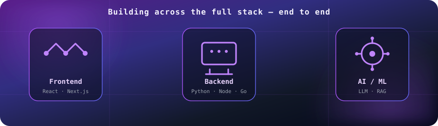

<!-- Replace every YOUR_USERNAME / YOUR_* placeholder before publishing -->
<!-- IMPORTANT: YOUR_USERNAME must be your exact GitHub login, no spaces, e.g. "uzair-dev" -->

 

---

## 👋 Hi, I'm Uzair

### Engineering With Purpose

I design and build modern software systems across the **frontend, backend, cloud, data, and AI** layers.

My focus is on turning complicated product requirements into **clean, scalable, secure, and maintainable systems** that are ready for real-world production environments.

---

## 🧰 Core Expertise

<table align="center">
  <tr>
    <td align="center" width="25%"><b>🎨 Frontend</b></td>
    <td align="center" width="25%"><b>⚙️ Backend</b></td>
    <td align="center" width="25%"><b>☁️ Cloud</b></td>
    <td align="center" width="25%"><b>🤖 AI</b></td>
  </tr>
  <tr>
    <td align="center">React Next.js TypeScript</td>
    <td align="center">Python Node.js Java Go</td>
    <td align="center">AWS Azure GCP Kubernetes</td>
    <td align="center">LLM RAG LangChain</td>
  </tr>
  <tr>
    <td align="center">
      
    </td>
    <td align="center">
      
    </td>
    <td align="center">
      
    </td>
    <td align="center">
      
    </td>
  </tr>
</table>

### 🛠️ Tools & Platforms

  

---

## 🧠 AI Engineering

  

- **LLM Applications** — AI-powered products, LLM APIs, prompt engineering, intelligent automation, and AI-assisted workflows
- **RAG Systems** — Retrieval-Augmented Generation, vector search, knowledge systems, document intelligence, and context-aware applications
- **Machine Learning** — model development, evaluation, and deployment alongside the full application stack

---

## 🧩 What I Build

  

---

## 🌐 Live Preview

  

<!-- Optional: add a screenshot that links to the live page

  

-->

---

## 🚀 Featured Projects

| Project | Description | Stack |
| :-- | :-- | :-- |
| [**Project One**](https://github.com/YOUR_USERNAME/PROJECT_ONE) | Short description of what it does and the problem it solves. | `Next.js` `TypeScript` `Python` |
| [**Project Two**](https://github.com/YOUR_USERNAME/PROJECT_TWO) | Short description of what it does and the problem it solves. | `LangChain` `RAG` `Python` |
| [**Project Three**](https://github.com/YOUR_USERNAME/PROJECT_THREE) | Short description of what it does and the problem it solves. | `Go` `Kubernetes` `AWS` |

---

## 📊 GitHub Stats

<!-- 

  
  

 -->

  

<!-- 

  

 -->

---

## 🤝 Let's Connect

  
  
  
  

---

### Moreover, I know ML and I am now a Full Stack AI Engineer. 🚀

*Open to collaboration on AI-powered products and production-grade systems.*

